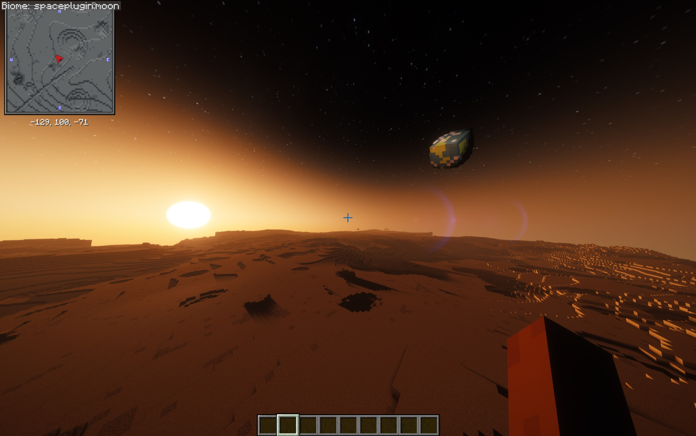
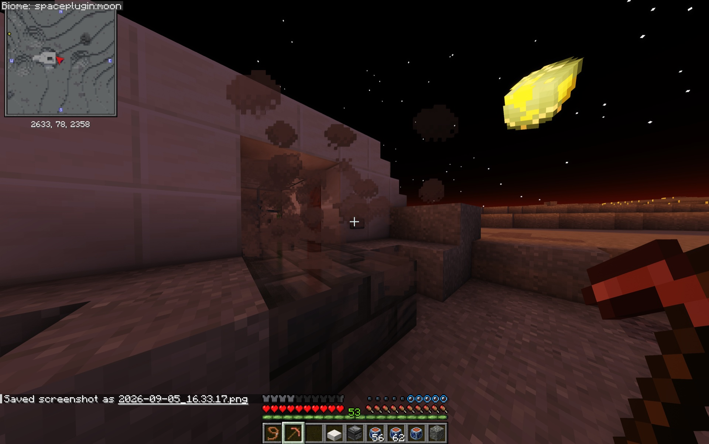

# Exploring The Moon

The Moon is the destination at the heart of the current Cosmonautics release. Artemis delivers each pilot to a persistent landing site with a habitat-equipped lander and a fueled route home.

{ .wiki-shot loading=lazy }

*Earth hangs above the Moon's generated terrain.*

## First landing

Completing an Artemis touchdown earns **One Small Step** and awards a Habitat Deployer. The lander's lower structure remains at the site while its ascent stage is reserved for the return journey.

The Moon has reduced gravity and no naturally breathable atmosphere. Keep your suit sealed and monitor oxygen whenever you leave protected air.

## Build a lunar home

Deploy a habitat, seal its structure, and establish breathable air. Registering a bed inside fully breathable lunar air marks an important settlement milestone. Continued building, safe habitats, and lunar crafting carry the Space Program toward a permanent Moon base.

{ .wiki-shot loading=lazy }

*A finished lunar base uses sealed construction and greenery to maintain fully breathable air.*

## Explore beneath the surface

Generated Cosmonautics Moon worlds include catacombs with authored rooms and loot. Enter prepared: surface life support remains necessary underground, and the route back to the lander still matters.

Lunar exploration provides materials used for Lunar Alloy and later settlement progression.

{ .wiki-shot loading=lazy }

*A generated catacomb entrance exposed at the lunar surface.*

## Return to Earth

Bring Rocket Fuel to the lectern inside the lander habitat. The lectern controls the remaining ascent stage and launches it directly home. Use `/cosmo return` if you need a reminder at the landing site.

!!! note "External Moon worlds"
    A server can adopt a provider-owned Moon with a biome-only environment overlay. Its terrain and structures remain owned by that provider, so Cosmonautics catacombs are unavailable unless the provider supplies them.
