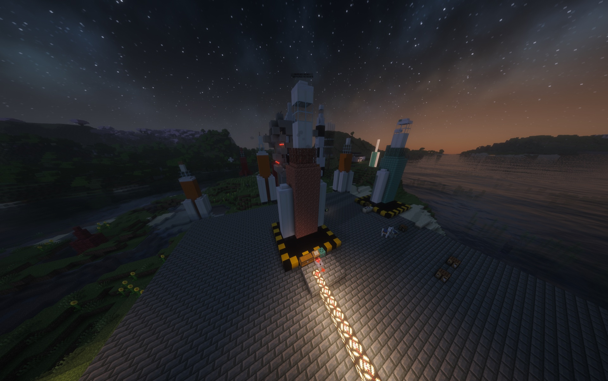

# Rockets And Launch Sites

Rockets in Cosmonautics begin as infrastructure and materials, not a menu shortcut. The main Earth–Moon mission uses a player-built Artemis launch site with Mission Control, staged construction, propellant, and an animated flight.

{ .wiki-shot loading=lazy }

*Artemis on its completed pad, with the Launch Controller and supply infrastructure at its base.*

## Build the launch site

The Artemis pad is a 10 × 10 structure. A complete site connects three important fixtures:

- **Launch Controller:** the lectern used to inspect and operate the site.
- **Supply chest:** holds construction materials, Rocket Fuel, and Oxidizer.
- **Comparator:** points away from the controller and reports construction progress; signal 15 means the site is ready.

Run `/cosmo tutorial launch-site` for a private animated lesson showing the exact pad, controller wiring, chest placement, comparator direction, and Artemis assembly sequence.

## Construct and fuel Artemis

Open the Launch Controller to inspect missing structure materials and site status. Supplied materials are consumed as the vehicle assembles from its production parts. Rocket Fuel and Oxidizer then prepare the completed rocket for launch.

If launch is blocked, use `/cosmo route <destination>` for the missing requirement and next action. `/cosmo rocket` opens the launch-site guide.

## Flight and staging

Once ready, the mission includes ignition, powered ascent, stage separation, and the handoff to its destination. Detached mission stages can leave recoverable salvage after flight.

The wider Space Program also introduces V-2 development, Sputnik reconnaissance, and Soyuz passenger transport. Artemis remains the supported direct route between Earth and the Moon.

## Returning from the Moon

The lunar lander remains at its assigned landing site. Place Rocket Fuel into the lectern inside its habitat and use that control to launch the ascent stage home. `/cosmo return` explains the correct return method for your current destination.

!!! warning "Prepare before launch"
    Wear a complete sealed suit and carry Oxygen Canisters before leaving Earth. Space and the Moon cannot be treated like breathable overworld environments.
