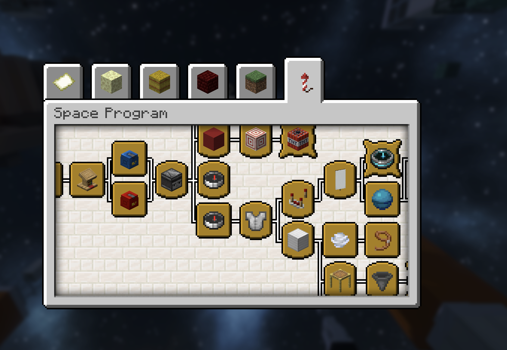

# The Space Program

The **Space Program** is a 29-milestone advancement journey through rocketry, survival equipment, orbital operations, cooperation, lunar exploration, and settlement.

Craft or launch a Firework Rocket to reveal the tab. Progress begins after Cosmonautics is installed; earlier accomplishments are not inferred.

{ .wiki-shot loading=lazy }

*The Space Program branches from early rocketry into survival, Station, and lunar progression.*

## Early rocketry

The opening milestones lead from lighting a Firework Rocket to building a launch pad and establishing Mission Control. Rocket Fuel and Oxidizer form parallel preparation branches before experimental V-2 and Sputnik development.

Fuel and Oxidizer milestones each track 30 crafted items. These advancements describe and reward the journey; they do not lock the underlying recipes or commands.

## Orbital branch

The optional Station branch includes:

- Reaching low Earth orbit
- Learning RCS course correction and EVA tethering
- Assembling station equipment
- Harvesting real asteroid output
- Visiting another player's dock
- Completing a Station voyage and returning safely

Reaching low Earth orbit awards an EVA Harness.

## Moon branch

The supported lunar branch begins with a cleared Artemis launch and **One Small Step**. It continues through returning home, repeated lunar travel, breathable habitats, settlement, lunar crafting, and entering generated catacombs.

**One Small Step** awards a Habitat Deployer. Other milestones award experience and occasional one-time items.

## Guidance, not gates

Advancements show useful goals and celebrate accomplishments, but they never gate commands, recipes, travel, or other plugin features. Use `/cosmo guide` for the concise in-game route and `/cosmo route <destination>` when you are unsure what a launch still requires.
