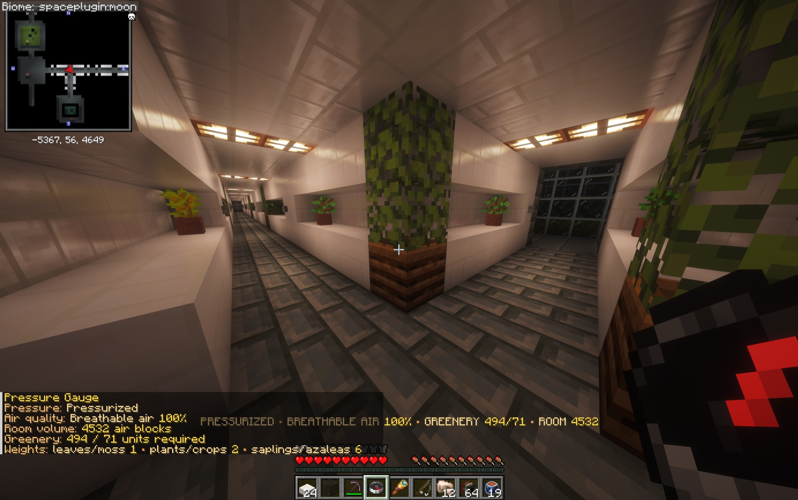

# Surviving Space

Space is hostile even when the rocket works perfectly. Cosmonautics models breathable air, oxygen reserves, pressure loss, decompression, low- and zero-gravity movement, and the equipment needed to survive them.

{ .wiki-shot loading=lazy }

*The Pressure Gauge confirms that this sealed Moon base is pressurized with 100% breathable air.*

## Your survival equipment

- **Glass helmet and white suit:** a complete sealed outfit for vacuum exposure.
- **Oxygen Canisters:** carried reserves for places without breathable air.
- **Pressure Gauge:** checks whether the surrounding atmosphere is safe.
- **EVA Harness:** creates a visible safety tether to a nearby solid surface.
- **Magnetic Boots:** station equipment for controlled movement around metal structures.

Use `/cosmo status` to review your suit, oxygen, canisters, fuel, and current destination.

## Pressure and breathable rooms

A room must be sealed before it can hold pressure. Even one broken block can vent its atmosphere and trigger decompression. After resealing a pressurized room, greenery can improve its air until it becomes breathable.

Check with a Pressure Gauge before removing your helmet. The `/cosmo tutorial survive-space` lesson lets you breach and reseal a private demonstration room without changing real blocks.

## Airlocks

Never open both airlock doors at once. Enter through the first door, close it behind you, then open the second door only after the chamber is isolated from the habitat.

## EVA and zero gravity

At the orbital Station, movement input provides RCS corrections and Shift gives a forward burst. Recoil and collisions matter when there is no ordinary gravity to bring you back down. Attach an EVA Harness near a solid surface before drifting away from the structure.

!!! danger "Vacuum checklist"
    Complete suit, Oxygen Canisters, known pressure state, and a safe return route should all be confirmed before leaving a pressurized area.
