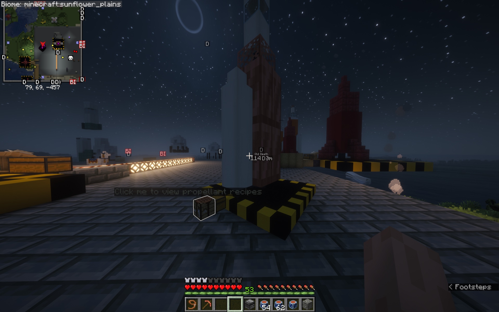
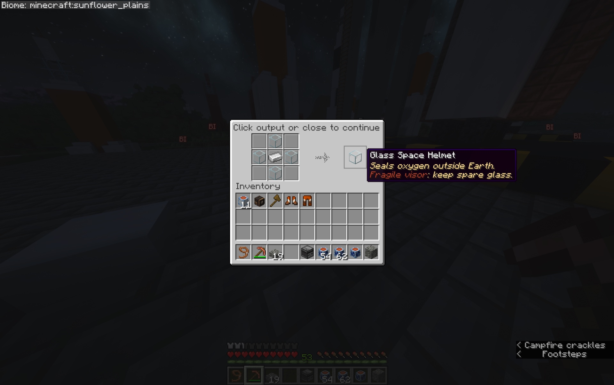
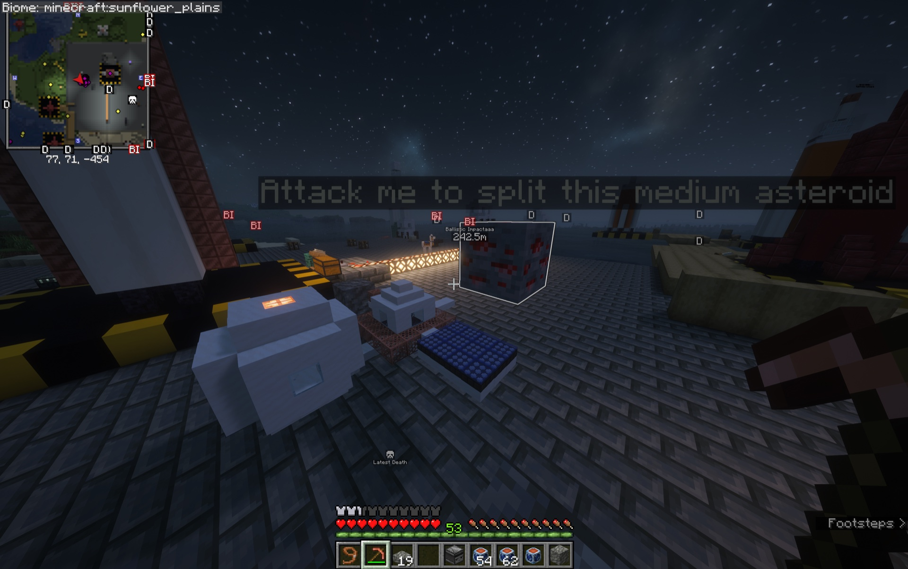

# Interactive Tutorials

Cosmonautics tutorials teach complete systems through private, interactive scenes. Open the catalog with:

```text
/cosmo tutorial
```

Select a lesson in chat or start one directly with `/cosmo tutorial <tutorial-id>`. Use `/cosmo tutorial stop` to leave at any time.

## See a tutorial in action

<video controls preload="metadata" playsinline poster="../images/launch-site-tutorial-poster.jpg" class="wiki-video">
  <source src="../videos/launch-site-tutorial.mp4" type="video/mp4">
  Your browser does not support embedded video. You can <a href="../videos/launch-site-tutorial.mp4">download the Launch Site tutorial recording</a> instead.
</video>

*A short playthrough of the Launch Site lesson, from constructing the pad to previewing Artemis and its propellants.*

## Available lessons

### Launch Site

```text
/cosmo tutorial launch-site
```

Build the 10 × 10 Artemis pad, craft and place the Launch Controller, connect its supply chest and progress comparator, preview Artemis assembly, and learn how Rocket Fuel and Oxidizer prepare the vehicle for launch.

{ .wiki-shot loading=lazy }

*Glowing objects and in-world prompts lead the player through each interactive step.*

### Survive in Space

```text
/cosmo tutorial survive-space
```

View recipes for a sealed suit, Oxygen Canisters, and the EVA Harness. The lesson then demonstrates pressure loss through broken glass, resealing and oxygenating a habitat, reading a Pressure Gauge, and cycling an airlock without opening both doors together.

{ .wiki-shot loading=lazy }

*Tutorial recipe windows are safe previews: click the output or close the window to continue.*

### Space Station

```text
/cosmo tutorial space-station
```

Follow a station-founding mission into orbit, dock with the new station, install solar panels, process ice and mineral asteroids, operate the automated collector and defensive machines, preview access settings, and return to Earth.

{ .wiki-shot loading=lazy }

*The Station lesson uses glowing targets to demonstrate asteroid processing and machinery.*

## Controls and interactions

- Follow action-bar narration and click glowing scene objects when prompted.
- Use the chat controls to move between chapters, replay, or exit. Interaction boundaries advance directly to the next glowing target.
- A completed scene remains visible until you use its glowing finish target.
- Only one tutorial session runs for you at a time.

!!! info "Private and safe"
    Tutorial blocks, entities, inventories, recipes, machines, and items exist only in your client-side lesson. Tutorials do not alter real blocks, entities, inventories, player state, or gameplay state.
